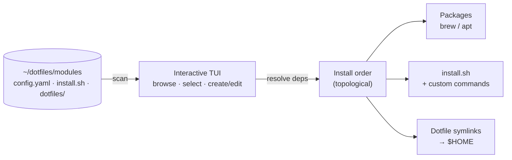

# DotCLI

A TUI-based dotfiles manager with intelligent package management and dependency resolution.

At a glance — DotCLI scans your modules, lets you pick them in a TUI, resolves their
dependencies, and installs each one (packages, scripts/commands, and dotfile symlinks):



## Features

- **Interactive TUI** for module selection and management
- **Package Manager Integration** - automatically detects and uses **brew** or **apt**
- **Dependency Resolution** - handles module dependencies automatically
- **Package Verification** - skips already installed packages
- **Module Creation** - built-in forms for creating new modules
- **Export Mode** - install only dotfiles without packages/commands

## Quick Start

```bash
# Build
go build -o bin/dotcli .

# Run
./bin/dotcli
```

## Configuration

By default DotCLI manages modules under `~/dotfiles/modules/` (created on first run).
Override the root directory with the `DOTFILES_PATH` environment variable — handy for
testing against a throwaway location:

```bash
DOTFILES_PATH=/tmp/my-dotfiles ./bin/dotcli
```

## Usage

### Interactive Interface
- `↑/↓` or `j/k` - Navigate modules
- `Space` - Select/deselect modules
- `/` - Filter/search modules (real-time)
- `x` - Toggle export mode (dotfiles only)
- `c` - Create new module
- `e` - Edit current module
- `a` - Add dotfile to current module
- `i` - Import dotfile to current module
- `Enter` - Install selected modules
- `?` - Toggle help (shows all keybindings)
- `Esc` - Clear filter/exit forms
- `q` - Quit

### Module Structure
```
~/dotfiles/modules/myapp/
├── config.yaml          # Module configuration
├── install.sh           # Custom setup script
└── dotfiles/            # Your dotfiles
    ├── .config/
    └── .myapprc
```

### Configuration Format
```yaml
name: myapp
description: "My application configuration"
dependencies:
  - shell
packages:
  common: [git, curl]
  specific:
    - name: myapp
      manager: brew
    - name: myapp
      manager: apt
commands:
  - command: "echo 'Custom setup command'"
    os: ""
dotfiles:
  - source: dotfiles/.config
    destination: ~/.config/myapp
```

## Working with Dotfiles

### Adding Dotfiles to Modules
1. **Add new dotfile mapping** (`a`): Define source and destination paths
2. **Import existing files** (`i`): Move existing config files into your dotfiles and create symlinks

### Import Process
When you import an existing file (e.g., `~/.bashrc`):
1. File is copied to your module's dotfiles directory
2. Original file is removed
3. Symlink is created from original location to module file
4. Configuration is updated automatically

### Export Mode
Perfect for when software is already installed and you just want to apply your configurations:
1. Press `x` to enable export mode
2. Select modules with `Space`
3. Press `Enter` to install only dotfiles (skips packages and commands)

### Smart Module Selection
For improved workflow efficiency:
- When adding dotfiles (`a`) or importing (`i`), the currently highlighted module is used automatically
- Navigate to the desired module first, then press `a` or `i` for instant operation
- No need to select the module again in forms - streamlined workflow
- Use `/` to quickly filter and find modules by name or description
- Filter works in real-time and supports fuzzy matching

### Path Expansion
The system supports various path formats:
- `~/.bashrc` - Home directory expansion
- `$HOME/.config/nvim` - Environment variable expansion
- `.bashrc` - Relative to home directory
- `/absolute/path` - Absolute paths

### Modern List Interface
Built with Charm's Bubbles list component for professional UX:
- Native list component with proper keybinding integration
- Smooth navigation with vim-style keybindings (`j/k`) and arrow keys
- Real-time fuzzy filtering with `/` to search modules instantly
- Visual selection indicators with checkmarks (✓)
- Built-in help system accessible with `?`
- Proper delegate pattern for custom actions (space, e, a, i, x)
- Responsive design that adapts to your terminal size
- Pagination support for large module lists

## Templates

- **basic** - Empty module
- **shell** - Shell configuration (zsh)
- **editor** - Editor configuration (neovim)
- **cli-tool** - CLI tools configuration

## Requirements

- Go 1.24+ (declared in `go.mod`)
- One of: **brew** or **apt** (the only package managers currently implemented)

## Documentation

Deeper reference for contributors lives under [`docs/`](docs/):

- [Architecture & data model](docs/architecture.md)
- [Features](docs/features/_index.md) — install pipeline, authoring, dotfile management, export mode
- [Conventions](docs/conventions.md) · [Runbook](docs/runbook.md)
- `CLAUDE.md` — orientation for AI assistants working in this repo