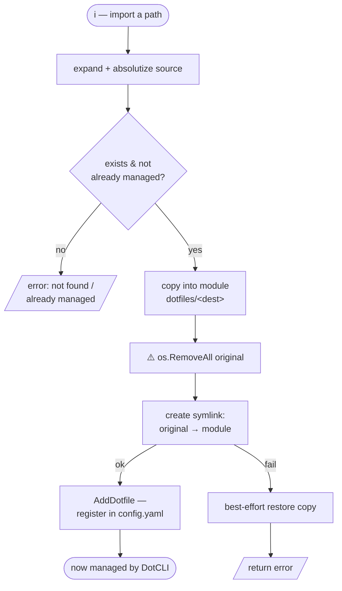

# dotfile-management

## What it does

Adds dotfile mappings to a module and imports existing files/directories into a module.
"Add" (`a`) registers a `source → destination` mapping in `config.yaml`. "Import" (`i`)
takes an existing path, moves it into the module, and replaces the original with a
symlink so the file is now managed by DotCLI. Both operate on the currently highlighted
module.

## Entry points

| Trigger | Entry point | File |
| ------- | ----------- | ---- |
| `a` — add mapping form | `Model.addDotfileForm` | `internal/ui/ui.go:745` |
| `i` — import form | `Model.importDotfileForm` | `internal/ui/ui.go:796` |
| Append a mapping to config | `Manager.AddDotfile` | `internal/manager/manager.go:230` |
| Import with explicit destination | `Manager.ImportDotfileWithDestination` | `internal/manager/manager.go:393` |
| Import (basename destination) | `Manager.ImportDotfile` | `internal/manager/manager.go:277` |
| Path expansion (`~`, `$HOME`, relative) | `Manager.expandPath` | `internal/manager/manager.go:355` |

## Files involved

- **`internal/ui/ui.go`** — `add`/`import` forms (source + destination inputs), stored
  in `AddFormData` / `ImportFormData`; completion handlers validate non-empty fields and
  call the manager, then reload.
- **`internal/manager/manager.go`** — `AddDotfile` (dedup-checks, appends to config),
  `ImportDotfileWithDestination` (the file-moving logic), `copyFile`/`copyDir`,
  `expandPath`.
- **`internal/installer/installer.go`** — Consumes the resulting mappings later via
  `createSymlinks` at install time.

## Data flow

**Add** (`a`): form yields `source` + `destination` → `AddDotfile` reads `config.yaml`,
rejects a duplicate `source+destination`, appends the mapping, rewrites the config.

**Import** (`i`): form yields a source path + an in-module destination →
`ImportDotfileWithDestination`:
1. Expand + absolutize the source; error if it doesn't exist or is already a symlink
   into this module.
2. Copy the file/dir into `<module>/dotfiles/<destination>` (recursive for dirs).
3. **Remove the original** (`os.RemoveAll`).
4. Create a symlink at the original location pointing into the module (best-effort
   restore-copy if the symlink step fails).
5. Compute a home-relative `destination` and call `AddDotfile` to register it.

The destructive window is between **remove original** and **create symlink** — a crash
there leaves the file living only inside the module:

## Edge cases

- **Import is destructive**: the original is deleted between the copy and the symlink. If
  the symlink fails, the code attempts to restore the copy, but a crash in between leaves
  the file only inside the module. (See architecture.md → Critical notes.)
- **Already-managed source** (a symlink already pointing into the module) → "file is
  already managed by this module".
- **Destination collision in module** → "file already exists in module: …".
- **Add duplicate mapping** → "dotfile mapping already exists".
- `destination` recorded in config is made relative to `$HOME` when the source was under
  home; otherwise the basename is used.

## Related ADRs

- _none yet_
