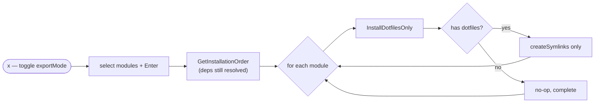

# export-mode

## What it does

Installs only the dotfile symlinks for the selected modules, skipping packages,
`install.sh`, and custom commands. Intended for machines where the software is already
present and you just want your configs applied. Toggled with `x`; the list footer then
shows "(dotfiles only)".

## Entry points

| Trigger | Entry point | File |
| ------- | ----------- | ---- |
| `x` — toggle `exportMode` | `Model.Update` (delegate `export`) | `internal/ui/ui.go:334` |
| Read flag after TUI exits | `Model.GetExportMode` | `internal/ui/ui.go:1220` |
| Install dotfiles only | `Installer.InstallDotfilesOnly` | `internal/installer/installer.go:434` |

## Files involved

- **`internal/ui/ui.go`** — Toggles `exportMode`, surfaces it via `GetExportMode()`, and
  renders the "(dotfiles only)" status hint.
- **`main.go`** — Branches on `GetExportMode()`: calls `InstallDotfilesOnly` instead of
  the full `InstallModule`, and prints export-specific messaging.
- **`internal/installer/installer.go`** — `InstallDotfilesOnly` runs only
  `createSymlinks`.

## Data flow

Dependencies are still resolved the same way, but each module runs the symlink-only
path — no packages, `install.sh`, or commands:

1. `x` flips `Model.exportMode`.
2. On install, `main.go` reads `GetExportMode()`. Dependency ordering is still computed
   the same way (`GetInstallationOrder`).
3. For each module the goroutine calls `InstallDotfilesOnly`, which emits a start status,
   creates symlinks if the module has any dotfiles, and emits a completion status — no
   package manager, script, or command execution.

## Edge cases

- Export mode **still installs dependency modules** (the order includes them), but each
  is installed dotfiles-only — so a dependency that exists purely to install a package
  contributes nothing in this mode. [INFERRED]
- A module with no `dotfiles` entries completes immediately with no filesystem change.

## Related ADRs

- _none yet_
