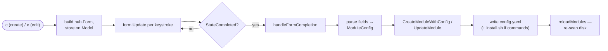

# module-authoring

## What it does

Lets the user create and edit modules through interactive `huh` forms, including
built-in starter templates (`basic`, `shell`, `editor`, `cli-tool`). Create is bound to
`c`; edit (of the highlighted module) is bound to `e`.

## Entry points

| Trigger | Entry point | File |
| ------- | ----------- | ---- |
| `c` — open create form | `Model.createModuleForm` | `internal/ui/ui.go:382` |
| `e` — open edit form for current module | `Model.editModuleForm` | `internal/ui/ui.go:556` |
| Create from form values | `Manager.CreateModuleWithConfig` | `internal/manager/manager.go:110` |
| Create from a named template | `Manager.CreateModule` | `internal/manager/manager.go:32` |
| Update existing module | `Manager.UpdateModule` | `internal/manager/manager.go:176` |
| Template definitions | `Manager.getTemplate` | `internal/manager/manager.go:540` |

## Files involved

- **`internal/ui/ui.go`** — Builds the `huh` form groups (basic info, dependencies,
  common/specific packages, common/specific commands), stores values in
  `CreateFormData` / `EditFormData`, and on completion parses them into a
  `ModuleConfig` and calls the manager, then reloads the list.
- **`internal/manager/manager.go`** — Writes `config.yaml` (and, when there are custom
  commands, an `install.sh`) under `~/dotfiles/modules/<name>/`; holds the template map.
- **`internal/models/module.go`** — `ModuleConfig`, `PackageManager`, `InstallCommand`.

## Data flow

1. `c`/`e` → builds a `huh.Form`, stores it on `Model.form` and `Model.mode`.
2. Each keystroke routes to `form.Update`; on `StateCompleted`, `handleFormCompletion`
   dispatches by mode to `handleCreateModuleCompletion` / `handleEditModuleCompletion`.
3. The handler parses comma-separated common packages and `;`-separated common commands,
   collects up to two specific packages/commands, builds a `ModuleConfig`, and calls
   `CreateModuleWithConfig` / `UpdateModule`.
4. `reloadModules` re-scans disk and resets selection so the new/edited module appears.

## Edge cases

- **Specific packages and specific commands are capped at 2 slots each** in both the
  create and edit forms. Editing a module whose `config.yaml` has more than 2 of either
  will not surface the extras — and saving the edit rewrites the config from the form,
  dropping them. (See architecture.md → Critical notes.)
- **`UpdateModule` preserves `dotfiles`** by reading the existing config first; only
  description/dependencies/packages/commands are overwritten.
- **Create rejects an existing name** (validated live in the form and again in the
  manager: `module '<name>' already exists`).
- **`install.sh` is only written on create when there is at least one non-empty custom
  command**; package-only / dotfile-only modules get no script.

## Related ADRs

- _none yet_
