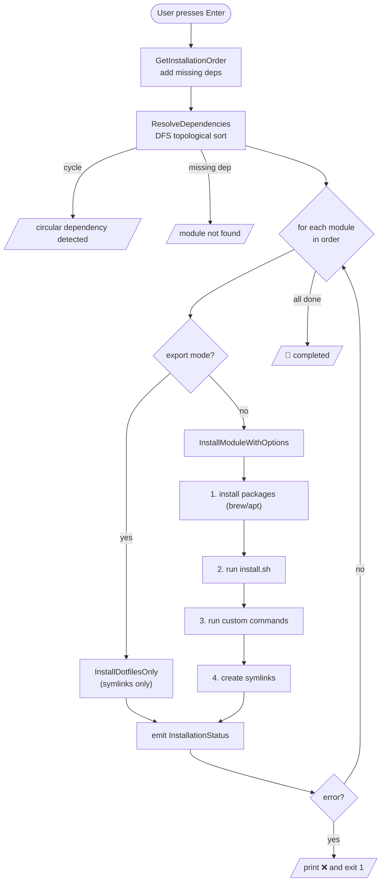

# module-installation

## What it does

Resolves module dependencies in topological order and installs the selected modules:
host packages (brew/apt), the module's `install.sh`, custom commands, and dotfile
symlinks. This is the core pipeline, triggered when the user presses `Enter` in the TUI
with at least one module selected.

## Entry points

| Trigger | Entry point | File |
| ------- | ----------- | ---- |
| `Enter` (install) sets `shouldInstall`, then TUI quits | `main()` install block | `main.go:55` |
| Compute dependency-respecting order | `Installer.GetInstallationOrder` | `internal/installer/installer.go:406` |
| Topological resolve + cycle detection | `Installer.ResolveDependencies` | `internal/installer/installer.go:29` |
| Install one module (full pipeline) | `Installer.InstallModuleWithOptions` | `internal/installer/installer.go:82` |

## Files involved

- **`main.go`** — Drives the post-TUI install loop: builds the install order, spawns a
  goroutine that installs each module, and prints `InstallationStatus` updates.
- **`internal/installer/installer.go`** — The whole engine: dependency resolution,
  package-manager detection, package install, script/command execution, symlink creation.
- **`internal/ui/ui.go`** — Sets `shouldInstall`/`quitting` on `Enter`; auto-selects
  dependencies when a module is selected (`autoSelectDependencies`).
- **`internal/models/module.go`** — `ModuleConfig`, `InstallOptions`, `InstallationStatus`.

## Data flow

1. User presses `Enter` → `ui` sets `shouldInstall=true`, quits the program.
2. `main.go` calls `GetInstallationOrder(modules, selected)`, which adds any missing
   dependencies of the selection and then `ResolveDependencies` does a DFS topological
   sort (tracking `visiting` to detect cycles).
3. A goroutine iterates the ordered names; for each it runs `InstallModuleWithOptions`:
   install packages → run `install.sh` (if present) → run custom commands → create
   symlinks, emitting an `InstallationStatus` (with a `Progress` fraction) at each step.
4. The main goroutine ranges over the status channel and prints emoji-prefixed lines.
   The first error sets `installationFailed`, breaks the loop, and exits non-zero.

## Edge cases

- **Circular dependencies** abort the whole run with `circular dependency detected: X`.
- **Missing dependency module** → `module not found: X`.
- **No supported package manager** (`detectPackageManager` finds neither brew nor apt)
  → packages/commands fail with `no supported package manager found`. [INFERRED]
- **`apt` path** runs `sudo apt-get update` then `sudo apt-get install -y …`
  non-interactively; an update failure is a warning, an install failure is fatal.
- **Specific packages** are filtered to the detected manager, so a module with only
  `apt` specifics installs nothing on a brew host (no error).

## Related ADRs

- _none yet_
